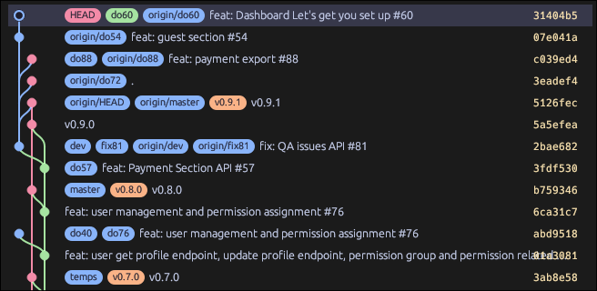

# gitr — a compact git commit graph viewer

Alternative to **gitk**, inspired by **VS Code Git Graph**.  
Runs from any git repo. See your commit graph, diffs, branches, and working tree changes all in one window.

<p align="center">
  
  <br>
  <em>Commit graph with branch lanes, working tree changes, and stash</em>
</p>


## Installation

### Linux

#### Option 1: AppImage (portable, no install)
```sh
# Download
wget -O gitr-x86_64.AppImage https://github.com/islandspan-solutions/gitr/releases/latest/download/gitr-x86_64.AppImage

# Make executable and run
chmod +x gitr-x86_64.AppImage
./gitr-x86_64.AppImage
```

To make `gitr` available as a terminal command from anywhere:
```sh
mv gitr-x86_64.AppImage ~/.local/bin/gitr
# or system-wide:
sudo mv gitr-x86_64.AppImage /usr/local/bin/gitr
# Now just type `gitr` in any terminal
```

#### Option 2: Binary tarball
```sh
# Download and extract
wget -O gitr.tar.gz https://github.com/islandspan-solutions/gitr/releases/latest/download/gitr-linux-x86_64.tar.gz
tar -xzf gitr.tar.gz

# Install system-wide
sudo mv gitr /usr/local/bin/gitr

# Now `gitr` works from any directory
```

#### Option 3: Build from source
**Dependencies:**
```sh
# Debian / Ubuntu
sudo apt install libgtk-3-dev libssl-dev pkg-config \
                 libxcb-render0-dev libxcb-shape0-dev libxcb-xfixes0-dev \
                 libxkbcommon-dev libfontconfig1-dev fuse libfuse2

# Arch Linux
sudo pacman -S gtk3 openssl pkg-config libxcb libxkbcommon libfontconfig fuse2

# Fedora
sudo dnf install gtk3-devel openssl-devel pkg-config libxcb-devel \
                 libxkbcommon-devel fontconfig-devel fuse
```

**Build & install:**
```sh
git clone https://github.com/islandspan-solutions/gitr.git
cd gitr
make build && sudo make install
# Now `gitr` works from any directory
```

**Uninstall:** `sudo rm /usr/local/bin/gitr`

---

### macOS

#### Option 1: Binary (if available from Releases)
```sh
# Download the macOS binary from the Releases page
chmod +x gitr-macos
sudo mv gitr-macos /usr/local/bin/gitr
```

#### Option 2: Build from source (requires Rust)
```sh
# Install Rust if you don't have it: https://rustup.rs
git clone https://github.com/islandspan-solutions/gitr.git
cd gitr
cargo build --release
sudo cp target/release/gitr /usr/local/bin/gitr
```

Now `gitr` works from any terminal.

> **Note:** On macOS, egui uses Metal for rendering. OpenGL dependencies are not needed.

---

### Windows

#### Option 1: Download binary (if available from Releases)
Download the Windows executable from the [Releases page](https://github.com/islandspan-solutions/gitr/releases) and run `gitr.exe`.

#### Option 2: Build from source (requires Rust)
```powershell
# Install Rust: https://rustup.rs
git clone https://github.com/islandspan-solutions/gitr.git
cd gitr
cargo build --release
# The binary is at target/release/gitr.exe
# Add it to your PATH or run it directly
```

To make `gitr` available from any terminal, add the folder containing `gitr.exe` to your `PATH` environment variable.

---

## Quick start

```sh
cd /path/to/any/git/repo
gitr
```

That's it — the commit graph appears instantly.

## Features

- **Compact graph** — branch lanes recycle automatically, no pyramid effect
- **Side-by-side diff** — meld-style viewer with red/green/blue highlighting
- **Ref pills** — HEAD, branches, and tags shown as rounded badges
- **Working tree awareness** — staged/unstaged changes shown as a virtual branch with yellow/red indicators
- **Stash support** — stashes appear as special rows in the graph (mauve nodes)
- **Branch management** — right-click a branch pill to checkout, rename, or delete
- **Live auto-reload** — detects `git add`, `git commit`, `git checkout`, `git push`, and file edits automatically
- **Aligned metadata** — author, date, hash columns
- **Curved bezier lanes** — smooth S-curves for branch/merge transitions
- **Dark theme** — Catppuccin Mocha palette

## Controls

| Key | Action |
|---|---|
| `gitr` | Launch from any git repo |
| `Ctrl+Q` / `Ctrl+C` / `Esc` | Exit |
| `Ctrl+R` | Refresh |
| Click a row | Select commit, show diff in right panel |
| Right-click a branch pill | Checkout / Rename / Delete |
| Search + Enter | Find commits by message/author/hash |

## Usage

```sh
gitr                # open repo in current directory
gitr /path/to/repo  # open a specific repo
gitr --current      # only the current branch, not all refs
gitr --limit 200    # cap how many commits are loaded
```

## About

gitr (r = Rust) was inspired by **gitg** (GNOME Git graphical interface) and **gitk**.  
It brings together the visual tree of gitg and the quick terminal accessibility of gitk, making it easy to browse your repository and check file diffs at a glance.

Fully open source.

## Support

If you find this useful, [buy me a coffee ☕](https://buymeacoffee.com/lahirusamishka)
